# 🚀 Artificial Intelligence Lab Manual

<div align="center">


### *From Data Analysis to RAG-Powered Chatbots* 🤖

[📚 Explore Labs](#-complete-lab-collection) · [🛠️ Technologies](#-technology-stack) · [🎯 Getting Started](#-quick-start-guide) · [📬 Contact](#-lets-connect)

</div>

---

## 👩‍🎓 **About Me**

<div align="center">


| **Field** | **Details** |
|-----------|-------------|
| 👤 **Name** | Zara Imran |
| 🆔 **SAP ID** | 70149236 |
| 🎓 **Program** | BSIET (Information Engineering Technology) |
| 📚 **Course** | CS13207 - Artificial Intelligence |
| 🏫 **Institution** | University of Lahore |
| 👨‍🏫 **Instructor** | Dr. Syed M Hamedoon |
| 📅 **Semester** | Fall 2025 |

</div>

---

## 🎯 **Course Vision**

<div align="center">

> *"Transforming theoretical AI concepts into practical, real-world implementations"*

**CLO3:** Apply AI algorithms using MATLAB/Python **(P5, PLO5)**

</div>

---

## 📊 **Learning Journey Map**

```mermaid
graph LR
    A[🔰 Foundations] --> B[🧠 Classical ML]
    B --> C[🌟 Neural Networks]
    C --> D[🔥 Deep Learning]
    D --> E[📊 Clustering]
    E --> F[🎮 Reinforcement Learning]
    F --> G[💬 NLP & RAG]
    
    style A fill:#4CAF50,stroke:#333,stroke-width:2px,color:#fff
    style B fill:#2196F3,stroke:#333,stroke-width:2px,color:#fff
    style C fill:#FF9800,stroke:#333,stroke-width:2px,color:#fff
    style D fill:#E91E63,stroke:#333,stroke-width:2px,color:#fff
    style E fill:#9C27B0,stroke:#333,stroke-width:2px,color:#fff
    style F fill:#F44336,stroke:#333,stroke-width:2px,color:#fff
    style G fill:#00BCD4,stroke:#333,stroke-width:2px,color:#fff
```



---

## 📚 **Complete Lab Collection**

<details open>
<summary><b>🔰 PHASE 1: Foundations (Labs 1-2)</b></summary>

| Lab | Topic | Core Skills | Difficulty |
|:---:|-------|------------|:----------:|
| **01** | 🐍 **Python Environment Setup** | VS Code, Google Colab, Data Visualization | ⭐ |
| **02** | 📈 **Regression Analysis** | Linear Regression, Logistic Regression, Model Evaluation | ⭐⭐ |

</details>

<details open>
<summary><b>🧠 PHASE 2: Classical Machine Learning (Labs 3-4)</b></summary>

| Lab | Topic | Core Skills | Difficulty |
|:---:|-------|------------|:----------:|
| **03** | 🌳 **Decision Trees** | Entropy, Information Gain, Tree Visualization | ⭐⭐ |
| **04** | 🌲 **Random Forest & SVM** | Ensemble Methods, Kernel Tricks, Hyperparameter Tuning | ⭐⭐⭐ |

</details>

<details open>
<summary><b>🌟 PHASE 3: Neural Networks (Labs 5-6)</b></summary>

| Lab | Topic | Core Skills | Difficulty |
|:---:|-------|------------|:----------:|
| **05** | 🧬 **Artificial Neural Networks** | Feedforward Networks, Backpropagation, Activation Functions | ⭐⭐⭐ |
| **06** | 🎯 **Deep Neural Networks** | Multi-layer Architecture, Dropout, Batch Normalization | ⭐⭐⭐⭐ |

</details>

<details open>
<summary><b>🔥 PHASE 4: Advanced Deep Learning (Labs 7-9)</b></summary>

| Lab | Topic | Core Skills | Difficulty |
|:---:|-------|------------|:----------:|
| **07** | ⏱️ **Recurrent Neural Networks** | Sequential Data, Time Series, Memory Cells | ⭐⭐⭐⭐ |
| **08** | 🧠 **LSTM Networks** | Long-term Dependencies, Gates, Text Generation | ⭐⭐⭐⭐⭐ |
| **09** | 🖼️ **Convolutional Neural Networks** | Image Processing, Feature Extraction, Transfer Learning | ⭐⭐⭐⭐⭐ |

</details>

<details open>
<summary><b>📊 PHASE 5: Unsupervised Learning (Labs 10-11)</b></summary>

| Lab | Topic | Core Skills | Difficulty |
|:---:|-------|------------|:----------:|
| **10** | 🎯 **K-Means Clustering** | Centroid Calculation, Elbow Method, Silhouette Score | ⭐⭐⭐ |
| **11** | 🌳 **Hierarchical Clustering** | Dendrograms, Linkage Methods, Distance Metrics | ⭐⭐⭐ |

</details>

<details open>
<summary><b>🎮 PHASE 6: Reinforcement Learning (Lab 12)</b></summary>

| Lab | Topic | Core Skills | Difficulty |
|:---:|-------|------------|:----------:|
| **12** | 🕹️ **Q-Learning & Gym** | CartPole, MountainCar, Policy Optimization | ⭐⭐⭐⭐⭐ |

</details>

<details open>
<summary><b>💬 PHASE 7: NLP & RAG Systems (Labs 13-15)</b></summary>

| Lab | Topic | Core Skills | Difficulty |
|:---:|-------|------------|:----------:|
| **13** | 📝 **Natural Language Processing** | Word2Vec, Embeddings, Semantic Analysis | ⭐⭐⭐⭐ |
| **14** | 📄 **Document Loading (RAG)** | LangChain, PDF/CSV Loaders, Data Ingestion | ⭐⭐⭐⭐ |
| **15** | 🤖 **RAG Chatbot** | Ollama, Streamlit, FAISS, Vector Search | ⭐⭐⭐⭐⭐ |

</details>

---

## 🛠️ **Technology Stack**

<div align="center">

### **Core Technologies**


### **Data & Visualization**


### **Advanced Frameworks**


### **Development Tools**


</div>

---

## 🎯 **Quick Start Guide**

### **Step 1: Clone the Repository**

```bash
git clone https://github.com/zaraimran/AI_Lab_Manuals.git
cd AI_Lab_Manuals
```

### **Step 2: Set Up Environment**

```bash
# Create virtual environment
python -m venv venv

# Activate environment
# Windows:
venv\Scripts\activate
# macOS/Linux:
source venv/bin/activate
```

### **Step 3: Install Dependencies**

```bash
# Upgrade pip
pip install --upgrade pip

# Install core libraries
pip install pandas numpy matplotlib seaborn scipy

# Install ML frameworks
pip install scikit-learn tensorflow keras torch

# Install specialized tools
pip install langchain langchain-community streamlit faiss-cpu
pip install nltk gensim python-dotenv gymnasium pygame
```

### **Step 4: Launch Jupyter Notebook**

```bash
jupyter notebook
```

---

## 🌟 **Featured Projects**

<div align="center">

### **🖼️ Lab 9: Cat vs Dog CNN Classifier**

<table>
<tr>
<td width="60%">

**Technologies Used:**
- Custom CNN Architecture
- Keras Sequential API
- Image Augmentation
- Real-time Predictions

**Key Features:**
- ✅ 95%+ Accuracy
- ✅ Confusion Matrix Visualization
- ✅ Real-time Prediction Interface
- ✅ Model Optimization

</td>
<td width="40%">

```python
model = Sequential([
    Conv2D(32, (3,3), activation='relu'),
    MaxPooling2D(2,2),
    Conv2D(64, (3,3), activation='relu'),
    MaxPooling2D(2,2),
    Flatten(),
    Dense(128, activation='relu'),
    Dropout(0.5),
    Dense(2, activation='softmax')
])
```

</td>
</tr>
</table>

---

### **🎮 Lab 12: Reinforcement Learning Agent**

<table>
<tr>
<td width="60%">

**Environments:**
- CartPole-v1 (Balance Control)
- MountainCar-v0 (Momentum Building)

**Algorithms:**
- Q-Learning Implementation
- Policy Optimization
- Reward Shaping

**Achievements:**
- 🏆 Solved CartPole in 50 episodes
- 🏆 Optimal momentum strategy
- 🏆 Real-time visualization

</td>
<td width="40%">

```python
# Q-Learning Update
Q[state, action] = Q[state, action] + 
    alpha * (reward + 
    gamma * np.max(Q[next_state]) - 
    Q[state, action])
```

</td>
</tr>
</table>

---

### **🤖 Lab 15: RAG-Powered Chatbot**

<table>
<tr>
<td width="60%">

**Architecture:**
- Document Ingestion (PDF, CSV, Web)
- Vector Embeddings (FAISS)
- LLM Integration (Ollama LLAMA2)
- Web Interface (Streamlit)

**Capabilities:**
- 📄 Multi-format document support
- 🔍 Semantic search
- 💬 Context-aware responses
- ⚡ Real-time inference

</td>
<td width="40%">

```python
rag_chain = (
    {
        "context": retriever,
        "question": RunnablePassthrough()
    }
    | prompt
    | llm
    | output_parser
)
```

</td>
</tr>
</table>

</div>

---

## 📈 **Progress Tracker**

<div align="center">

| Category | Completion |
|----------|-----------|
| **Foundations** |  |
| **Classical ML** |  |
| **Neural Networks** |  |
| **Deep Learning** |  |
| **Clustering** |  |
| **Reinforcement Learning** |  |
| **NLP & RAG** |  |

**Overall Completion:** 

</div>

---

## 🎓 **Learning Outcomes**

<div align="center">

### **Core Competencies Acquired**

</div>

<table>
<tr>
<td width="50%" valign="top">

#### 📊 **Data Science & Analysis**
- ✅ Data Collection & Preprocessing
- ✅ Exploratory Data Analysis (EDA)
- ✅ Data Visualization (Matplotlib, Seaborn)
- ✅ Statistical Modeling & Analysis
- ✅ Feature Engineering

#### 🤖 **Machine Learning**
- ✅ Supervised Learning Algorithms
- ✅ Unsupervised Learning Techniques
- ✅ Model Selection & Validation
- ✅ Hyperparameter Tuning
- ✅ Cross-Validation Strategies

#### 🧠 **Deep Learning**
- ✅ Artificial Neural Networks (ANN)
- ✅ Deep Neural Networks (DNN)
- ✅ Convolutional Neural Networks (CNN)
- ✅ Recurrent Neural Networks (RNN)
- ✅ Long Short-Term Memory (LSTM)

</td>
<td width="50%" valign="top">

#### 🎮 **Advanced AI Techniques**
- ✅ Reinforcement Learning
- ✅ Q-Learning & Policy Optimization
- ✅ Natural Language Processing
- ✅ Word Embeddings (Word2Vec)
- ✅ Retrieval-Augmented Generation (RAG)

#### 🛠️ **Tools & Frameworks**
- ✅ TensorFlow & Keras
- ✅ PyTorch
- ✅ Scikit-Learn
- ✅ LangChain
- ✅ Streamlit
- ✅ OpenAI Gym / Gymnasium

#### 💼 **Professional Skills**
- ✅ Version Control (Git)
- ✅ Code Documentation
- ✅ Project Management
- ✅ Problem Solving
- ✅ Technical Communication

</td>
</tr>
</table>

<div align="center">

### **Skills Progression Flow**

```
🔰 Foundations → 📊 Classical ML → 🧠 Neural Networks → 🔥 Deep Learning → 
📈 Clustering → 🎮 RL → 💬 NLP → 🤖 RAG Systems
```

### **Mastery Levels Achieved**

| Skill Category | Proficiency Level | Labs Covered |
|----------------|-------------------|--------------|
| **Data Analysis** | ⭐⭐⭐⭐⭐ Advanced | Labs 1-2 |
| **Classical ML** | ⭐⭐⭐⭐⭐ Advanced | Labs 3-4 |
| **Neural Networks** | ⭐⭐⭐⭐⭐ Advanced | Labs 5-6 |
| **Deep Learning** | ⭐⭐⭐⭐⭐ Advanced | Labs 7-9 |
| **Clustering** | ⭐⭐⭐⭐☆ Proficient | Labs 10-11 |
| **Reinforcement Learning** | ⭐⭐⭐⭐☆ Proficient | Lab 12 |
| **NLP & RAG** | ⭐⭐⭐⭐⭐ Advanced | Labs 13-15 |

</div>

---

## 🏆 **Assessment Rubrics**

<div align="center">

### **Each Lab Evaluated on 10 Parameters (100 Points Total)**

| Parameter | Weight | Description |
|-----------|--------|-------------|
| 📚 **Theoretical Knowledge** | 10% | Understanding of concepts |
| ⚙️ **Application Functionality** | 10% | Code execution & robustness |
| ✅ **Specifications Compliance** | 10% | Meeting requirements |
| 🧠 **Level of Understanding** | 10% | Problem-solving depth |
| 📖 **Code Quality** | 10% | Readability & reusability |
| 🤖 **AI System Design** | 10% | Architecture & maintainability |
| 💬 **Communication** | 10% | Documentation & presentation |
| ⚡ **Efficiency** | 10% | Performance optimization |
| ⏰ **Timeliness** | 10% | Deadline adherence |
| 🛡️ **Safety Compliance** | 10% | Lab protocols & ethics |

</div>

---

## 💡 **Key Takeaways**

<table>
<tr>
<td width="33%" align="center">

### 🎯 **Technical Skills**
- 15 AI/ML Algorithms
- 20+ Python Libraries
- 5 Deep Learning Architectures
- RAG System Development

</td>
<td width="33%" align="center">

### 🚀 **Practical Experience**
- 15 Complete Projects
- Real-world Datasets
- Production-ready Code
- Deployment Strategies

</td>
<td width="33%" align="center">

### 📊 **Industry Standards**
- Clean Code Practices
- Version Control (Git)
- Documentation
- Testing & Validation

</td>
</tr>
</table>

---

## 📂 **Repository Structure**

```
📦 AI_LAB_MANUALS/
│
├── 📁 Lab_01_Environment_Setup/
│   ├── 📓 Assignment1.ipynb
│   ├── 📄 LAB_01.pdf
│   ├── 📊 datasets/
│   └── 📖 README.md
│
├── 📁 Lab_02_Regression_Analysis/
│   ├── 📓 Assignment2.ipynb
│   ├── 📄 LAB_02.pdf
│   └── 📖 README.md
│
├── 📁 Lab_03_Decision_Trees/
│   ├── 📓 Assignment3.ipynb
│   ├── 📄 LAB_03.pdf
│   └── 📖 README.md
│
├── 📁 Lab_04_Random_Forest_SVM/
│   ├── 📓 Assignment4.ipynb
│   ├── 📄 LAB_04.pdf
│   └── 📖 README.md
│
├── 📁 Lab_05_Artificial_Neural_Networks/
│   ├── 📓 Assignment5.ipynb
│   ├── 📄 LAB_05.pdf
│   └── 📖 README.md
│
├── 📁 Lab_06_Deep_Neural_Networks/
│   ├── 📓 Assignment6.ipynb
│   ├── 📄 LAB_06.pdf
│   └── 📖 README.md
│
├── 📁 Lab_07_Recurrent_Neural_Networks/
│   ├── 📓 Assignment7.ipynb
│   ├── 📄 LAB_07.pdf
│   └── 📖 README.md
│
├── 📁 Lab_08_LSTM_Networks/
│   ├── 📓 Assignment8.ipynb
│   ├── 📄 LAB_08.pdf
│   └── 📖 README.md
│
├── 📁 Lab_09_CNN/
│   ├── 📓 Assignment9.ipynb
│   ├── 📄 LAB_09.pdf
│   └── 📖 README.md
│
├── 📁 Lab_10_K_Means_Clustering/
│   ├── 📓 Assignment10.ipynb
│   ├── 📄 LAB_10.pdf
│   └── 📖 README.md
│
├── 📁 Lab_11_Hierarchical_Clustering/
│   ├── 📓 Assignment11.ipynb
│   ├── 📄 LAB_11.pdf
│   └── 📖 README.md
│
├── 📁 Lab_12_Reinforcement_Learning/
│   ├── 📓 Assignment12.ipynb
│   ├── 📄 LAB_12.pdf
│   └── 📖 README.md
│
├── 📁 Lab_13_NLP/
│   ├── 📓 Assignment13.ipynb
│   ├── 📄 LAB_13.pdf
│   └── 📖 README.md
│
├── 📁 Lab_14_Document_Loading/
│   ├── 📓 Assignment14.ipynb
│   ├── 📄 LAB_14.pdf
│   └── 📖 README.md
│
├── 📁 Lab_15_RAG_Chatbot/
│   ├── 📓 Assignment15.ipynb
│   ├── 📄 LAB_15.pdf
│   ├── 🐍 app.py
│   ├── 🐍 localama.py
│   ├── 📋 requirements.txt
│   ├── 🔐 .env.example
│   └── 📖 README.md
│
├── 📖 README.md 
├── 📄 Complete_Lab_Manual.pdf
```

---

## 🤝 **Contributing**

<div align="center">

Contributions, issues, and feature requests are welcome!

[](https://github.com/zaraimran/AI_Lab_Manuals/issues)
[](https://github.com/zaraimran/AI_Lab_Manuals/pulls)

### **How to Contribute:**

1. 🍴 Fork the repository
2. 🌿 Create your feature branch (`git checkout -b feature/AmazingFeature`)
3. ✍️ Commit your changes (`git commit -m 'Add some AmazingFeature'`)
4. 📤 Push to the branch (`git push origin feature/AmazingFeature`)
5. 🔍 Open a Pull Request

</div>

---

## 📬 **Let's Connect!**

<div align="center">

[](https://github.com/zaraimran)
[](https://www.linkedin.com/in/zaraimran)
[](mailto:zaraimran@student.uol.edu.pk)

### **Course Instructor**

[](mailto:Muhammad.Hamedoon@tech.uol.edu.pk)

</div>

---

## 📚 **Additional Resources**

<div align="center">

| Resource | Link |
|----------|------|
| 🔬 **Scikit-Learn** | [Documentation](https://scikit-learn.org/) |
| 🧠 **TensorFlow** | [Tutorials](https://www.tensorflow.org/tutorials) |
| 🔗 **LangChain** | [Documentation](https://python.langchain.com/) |
| 🎨 **Streamlit** | [Documentation](https://docs.streamlit.io/) |
| 🤖 **OpenAI Gym** | [Documentation](https://gymnasium.farama.org/) |
| 📊 **Kaggle Datasets** | [Platform](https://www.kaggle.com/datasets) |

</div>

---

## 📜 **License**

<div align="center">

This project is part of academic coursework at the **University of Lahore** and is intended for **educational purposes only**.

[]()

</div>

---

## 🙏 **Acknowledgments**

<div align="center">

**Special Thanks To:**

🏛️ **University of Lahore** - Department of Technology  
👨‍🏫 **Dr. Syed M Hamedoon** - Exceptional Guidance & Mentorship  
🌐 **Open Source Community** - TensorFlow, PyTorch, LangChain Teams  
📚 **Online Resources** - Kaggle, GitHub, Stack Overflow  

</div>

---

## 📊 **Stats & Metrics**

<div align="center">


</div>

---

<div align="center">

## ⭐ **Show Your Support**

**If you found this repository helpful, please consider giving it a star!**

[](https://github.com/zaraimran/AI_Lab_Manuals/stargazers)
[](https://github.com/zaraimran/AI_Lab_Manuals/network/members)
[](https://github.com/zaraimran/AI_Lab_Manuals/watchers)

---

### 💖 **Made with Passion by Zara Imran**

*Transforming AI Concepts into Reality, One Lab at a Time*


---

**© 2025 Zara Imran | University of Lahore | BSIET**

</div>
